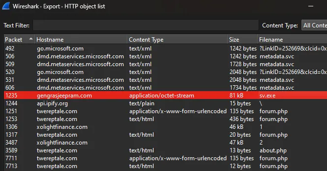
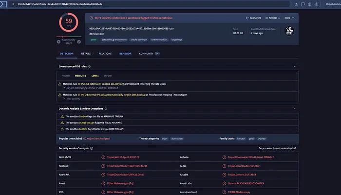
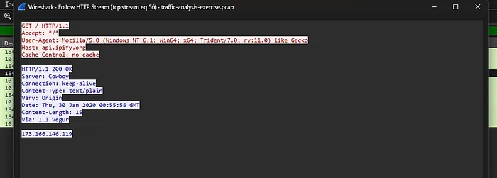
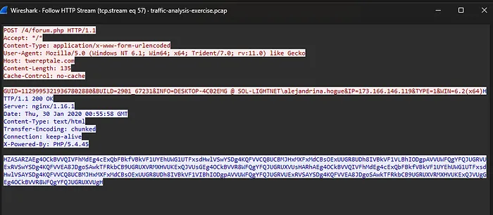

I like to solve malware traffic analysis challenges whenever I have some free time, so why not start a series as a way of helping others and taking notes?

So, this is the first episode of the Malware Traffic Analysis Series, have fun!

Today’s Challenge: [2020–01–30 — TRAFFIC ANALYSIS EXERCISE — SOL-LIGHTNET](https://www.malware-traffic-analysis.net/2020/01/30/index.html)


## Step 1: Downloading Files
Download the archive and extract it to your preferred directory.

The Password is “infected”

## Step 2: Context
We are provided with some data regarding the LAN segment of this machine

```
LAN segment data:
LAN segment range: 10.20.30[.]0/24 (10.20.30[.]0 through 10.20.30[.]255)
Domain: sol-lightnet[.]com
Domain controller: 10.20.30[.]2 - Sol-Lightnet-DC
LAN segment gateway: 10.20.30[.]1
LAN segment broadcast address: 10.20.30[.]255
```
## Step 3: Pcap Analysis
Let’s start analyzing the pcap file in Wireshark

Filtering Wireshark only to show us DNS packets, we can find some malicious or suspicious domains being communicated with


Suspicious domains found in the DNS packets are:

- gengrasjeepram[.]com = contains a malicious executable “sv.exe”
- twereptale[.]com = Likely a command-and-control server
- api[.]ipify[.]org = to retrieve the victim machine’s public IP address
- xolightfinance[.]com = contains

We can also see that there is an executable file downloaded with the name “sv.exe”



And this is its analysis report on Virustotal



After the download of this malicious exe, the victim machine sends a request to “api[.]ipify[.]org” to retrieve its public IP, which is “173[.]166[.]146[.]119”



After that, we have a POST request to the domain “twereptale.com”



It looks like the victim is sending information about itself, like public IP, hostname, build number, domain and username, CPU architecture, guid, etc…

Which makes me suspect this is the command-and-control server

after the request, the C&C replies with the following base64 encoded data

```
HZASARZAEg4OCkBVVQIVFhMdEg4cExQbFBkfVBkVF1UYEhUWG1UTFxsdHwlVSwYSDg4KQFVVCQ8UCBMJHxMXFxMdCBsOExUUGR8UDh8IVBkVF1VLBhIODgpAVVUWFQgYFQJUGRVUExRVSwYSDg4KQFVVEA8JDgoSAwkTFRkbCB9UGRUXVRMXHVUKExQJVUsGEg4OCkBVVR8WFQgYFQJUGRUXVUsHARhAEg4OCkBVVQIVFhMdEg4cExQbFBkfVBkVF1UYEhUWG1UTFxsdHwlVSAYSDg4KQFVVCQ8UCBMJHxMXFxMdCBsOExUUGR8UDh8IVBkVF1VIBhIODgpAVVUWFQgYFQJUGRVUExRVSAYSDg4KQFVVEA8JDgoSAwkTFRkbCB9UGRUXVRMXHVUKExQJVUgGEg4OCkBVVR8WFQgYFQJUGRUXVUgH
```

## Step 4: Alerts Analysis

Now, let us check the alerts that were provided with the pcap file


As we can see, the alerts indicate that a hostile executable file, likely trojan was installed on the device, and they also indicate that this malware’s name is “Hancitor”

## Conclusion
The victim machine was infected with a malware known as “HANCITOR”

which is a loader malware designed to install other malware on victim devices.

Indicators:

- gengrasjeepram[.]com port 80, GET request, /sv.exe
- twereptale[.]com port 80, POST request, /4/forum.php
- twereptale[.]com port 80, POST request, /mlu/forum.php
- twereptale[.]com port 80, POST request, /d2/about.php
- xolightfinance[.]com port 80, GET request, /bhola/images/1
- xolightfinance[.]com port 80, GET request, /bhola/images/2
- SHA256: 995cbbb422634d497d65e12454cd5832cf1b4422189d9ec06efa88ed56891cda