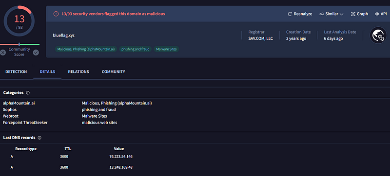
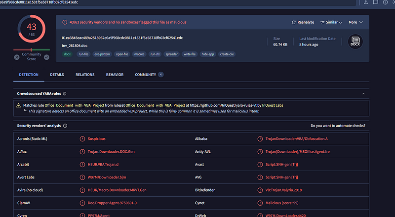

This time we will solve this challenge: [2020–02–21 - Traffic analysis exercise - One-Hot-Mess]()

## Step 1: Downloading Files

Download the rar archive and extract it in your preferred directory.
The password is: infected


## Step 2: Context
We are provided with some data about the LAN of the victim machine

```
LAN segment data:
LAN segment range:  172.17.8[.]0/24 (172.17.8[.]0 through 172.17.8[.]255)
Domain:  one-hot-mess[.]com
Domain controller:  172.17.8[.]8 - One-Hot-Mess-DC
LAN segment gateway:  172.17.8[.]1
LAN segment broadcast address:  172.17.8[.]255
```

## Step 3: Analysis
The first thing I notice when looking at the DNS packets in the pcap file, is this suspicious domain named "blueflag.xyz"


Searching for it on Virustotal, we can see that it is indeed marked as malicious, and it looks like it was used to distribute some kind of malware.



Let's further investigate any interaction with this domain.


The first thing we can see is that there is an HTTP GET request, sent to download a file "yrkbdmt.bin"

I can't see any other useful HTTP, or TCP packets, for now let's check **the provided alerts**


We can confirm that there was an exe file downloaded like we've discovered from the http traffic, but we can also see something interesting, the addition of a known malicious SSL certificate, which is apparently used the malware "dridex"

**Now Let's check the artifacts provided**

First thing that caught my eyes, was a .doc file, which i believe ran VB scripts to download further malware
Here is the scanning results on virustotal

